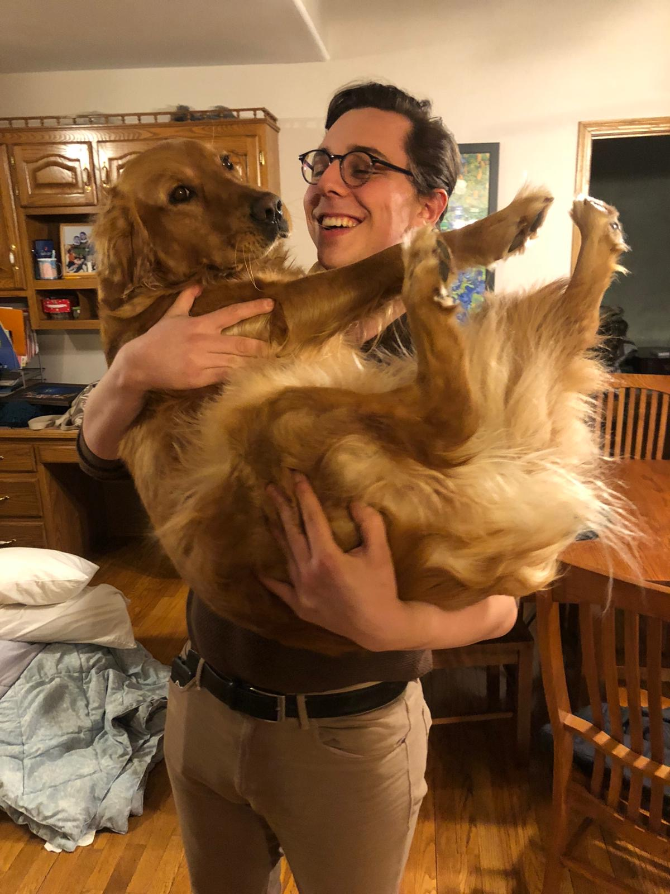

# Homework 01

Hello world! My name is Marc-Antoine Manzoni.
I'm a second (soon to be third year) in *The College*.
I am majoring in History, and minoring in East Asian Languages and Cultures (EALC). Please enjoy this picture of me and a very nice dog I met recently.. 
### Academic Interests
I've recently been taking classes focused on Chinese history of the late Imperial and Republican periods. In my last class, I spent a lot of time working from [this](https://repository.duke.edu/dc/gamble) photo collection from the period - I highly encourage you to take a look at it if you have time.
### Hobbies
I play the double **bass** and electric **bass**. I also sing **bass** with the University of Chicago Glee Club - you can check out a video of us [here](https://www.youtube.com/watch?v=7OD1kwWEbuY), if you'd like. It seems that the common denominator in my musical endeavors is the focus on **bass**. 

